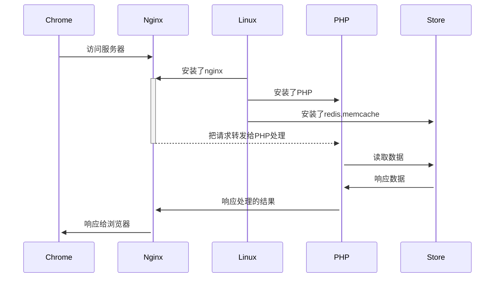

# 清流的烂笔头呀

> Just for recoding some important and funny things!

本人作为一名PHP开发者，经常需要使用linux操作系统，并在linux操作系统上安装各类软件。同时通过配置各类软件，配合工作，完成公司的开发相关的任务。所以在此记录下本人在工作中，生活中掌握的，学到的一些知识，以及一些思考总结、解决问题的方法。

## 路线图

## 学习任务

- [ ] Linux
  - [ ] 常用命令
  - [ ] 常用软件
- [ ] 编程语言
  - [ ] PHP
  - [ ] Python
  - [ ] Js
  - [ ] Dart
  - [ ] GoLang
- [ ] 编程思想
  - [ ] 面向对象
  - [ ] 设计模式及应用场景
  - [ ] 框架设计
- [ ] 系统架构
  - [ ] 微服务
  - [ ] SaaS服务
- [ ] Mysql应用及优化
- [ ] Redis应用及优化
- [ ] RabbitMq应用
- [ ] Elasticsearch应用
- [ ] ELK应用
- [ ] 小型企业内网服务搭建
- [ ] 基于PHP框架hyperf的saas系统实现
- [ ] 其他

## 致谢

 本文档Power by [docsify](https://docsify.js.org/), 相关使用方式参考[官方文档](https://docsify.js.org/#/quickstart)

Update At : {docsify-updated}
