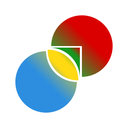

使用svg创建动态logo

```
<svg width="250px" height="250px" xmlns="http://www.w3.org/2000/svg" version="1.1">
    <svg x="25" y="25" width="200px" height="200px" viewBox="0 0 200 200" version="1.1"
         xmlns="http://www.w3.org/2000/svg">
        <defs>
            <linearGradient id="Gradient1" x1="1" x2="0" y1="0" y2="1">
                <stop offset="40%" stop-color="#DA0000"/>
                <stop offset="80%" stop-color="#189720" stop-opacity="0.9"/>
            </linearGradient>
            <linearGradient id="Gradient2" x1="1" x2="0" y1="0" y2="1">
                <stop offset="0%" stop-color="#DA0000"/>
                <stop offset="20%" stop-color="#189720"/>
                <stop offset="60%" stop-color="#189720"/>
                <stop offset="100%" stop-color="#ffd912"/>
            </linearGradient>
            <linearGradient id="Gradient3" x1="1" x2="0" y1="0" y2="1">
                <stop offset="0%" stop-color="#189720"/>
                <stop offset="40%" stop-color="#ffd912"/>
                <stop offset="50%" stop-color="#ffd912"/>
                <stop offset="60%" stop-color="#ffd912"/>
                <stop offset="100%" stop-color="#2D8EDF"/>
            </linearGradient>
            <linearGradient id="Gradient4" x1="1" x2="0" y1="0" y2="1">
                <stop offset="0%" stop-color="#ffd912"/>
                <stop offset="50%" stop-color="#2D8EDF"/>
            </linearGradient>
        </defs>
        <path d="M75 65
            A 60 60, 0, 1, 1, 135 125
            L 135 65 Z"
              fill="url(#Gradient1)"/>
        <path d="M71 68
            A 60 60, 0, 0, 1, 131 128
            L 131 68 Z"
              fill="url(#Gradient2)"/>
        <path d="M68 72
            A 60 60, 0, 0, 0, 128 132
            A 60 60, 0, 0, 0, 68 72 Z"
              fill="url(#Gradient3)"/>
        <path d="M65 75
            A 60 60, 0, 1, 0, 125 135
            A 60 60, 0, 0, 1, 65 75 Z"
              fill="url(#Gradient4)"/>
    </svg>
    <animateTransform
            attributeName="transform"
            type="rotate"
            from="0 0 0"
            to="360 0 0"
            dur="5s"
            fill="freeze"
            repeatCount="indefinite"
            additive="sum"/>
</svg>
```

