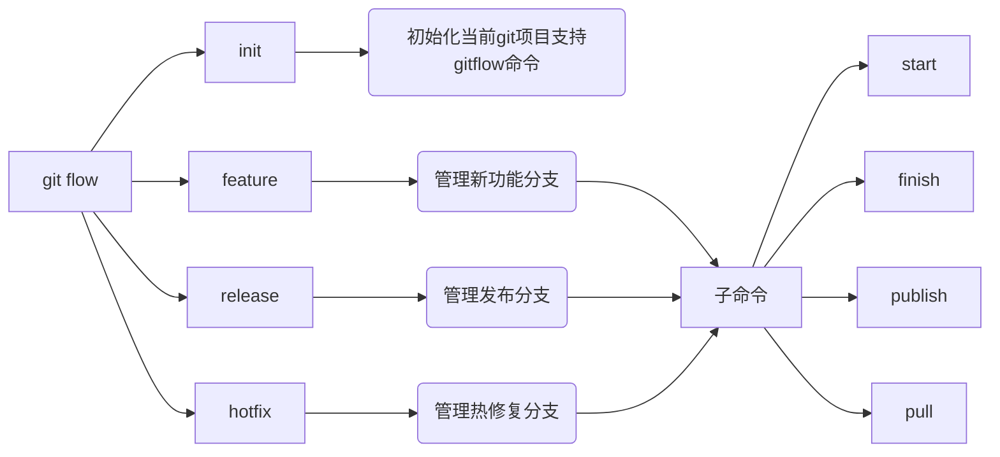

## gitflow使用说明

为了便于团队在代码上的写作，使用基于gitflow模式的版本分支发布管理方式。

## 流程示意图


以上流程图中，master分支和develop分支是黑色粗体，这两个为主要的实体分支存在，其他分支具有不确定性，可随时删除


## gitflow命令关系图



### 初始化

```bash
[root@localhost ~]#  git flow init

Which branch should be used for bringing forth production releases?
   - master
Branch name for production releases: [master] 
Branch name for "next release" development: [develop] 

How to name your supporting branch prefixes?
Feature branches? [feature/] 
Release branches? [release/] 
Hotfix branches? [hotfix/] 
Support branches? [support/] 
Version tag prefix? [] 
```

> 通过执行初始化命令，一路enter，会生额外的一个develop分支(如果原来不存在)
>
> 1. production 分支
>    生产分支，即为master分支，也可以自定义为某一分支。
> 2. development 分支
> 3. feature 分支
> 4. feature分支
> 5. feature分支


```bash
# 使用错误命令的方式列出子命令
git flow feature v

# 开始一个新功能开发分支ad
git flow feature start ad
# 该操作之后，会自动切换到feature/ad分支，在当前分支做正常的本地开发接口
# 同时原来的git四连变成了以下四连(如果线上没有对应的分支，不需要git pull)
git add . && git commit -m '备注信息' && git pull && git flow feature publish ad

# 列出当前开发的新功能分支&&切换本地不同的新功能区
git flow feature
git flow feature checkout ad

# 结束一个新功能开发
git flow feature finish ad
```

```bash
# 创建一次新的发布(此时的分支名和tag名同名)
git flow release start tag-name

# 结束release，此时会新建一个tag，同时，会让填入本次tag相关的描述内容
git flow release finish tag-name

# 推送本次发布打出的tag
git push origin tag-name
```

```bash
# 创建一次热修复(热修复的名称也会成为tag的名称)
git flow hotfix start v1.1.4

# 本地修改后，快速提交并合并代码到master与develop分支
# 合并的时候，需要创建新的标签，必须要写入标签备注才会成功;顺序先合并到master，再创建tag，最好合并到develop
git add . && git commit -m '热修复文档' && git flow hotfix finish v1.1.4

## 分别切换到master分支和develop分支提交合并的代码
git checkout master && git push
git checkout develop && git push

## 或者更简单，推送本地所有标签和分支
git push --all origin
git push --tag
```

## 发布名称

以v开头，三级版本，如v1.2.3，依次往下排, 更多内容参考语义化版本
